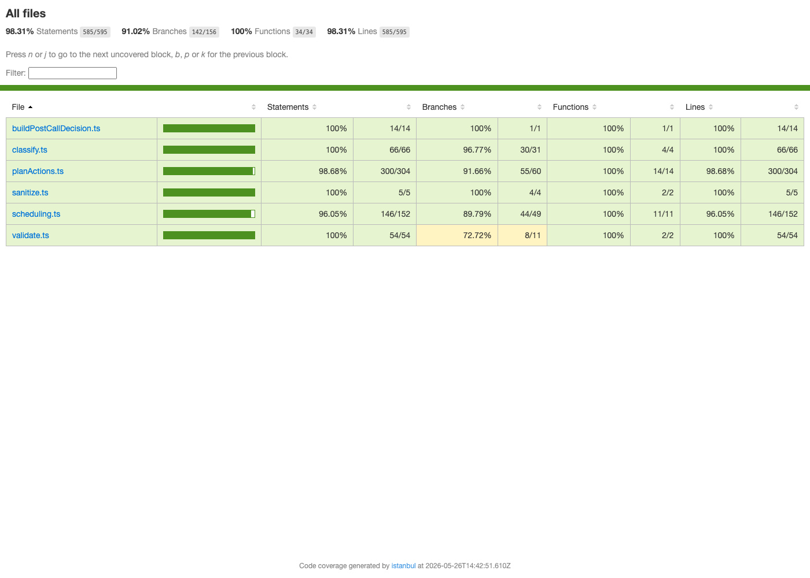
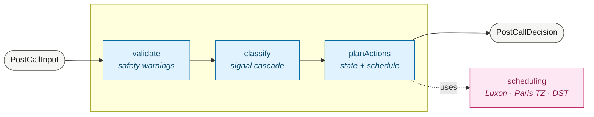

# Voxfit — Post-Call Decision Engine

> Take-home exercise. A deterministic TypeScript module that turns post-call signals
> (telephony, transcript-derived insights, tool events, case context) into a normalized
> decision: outcome, case state patch, scheduled actions, warnings, audit log.

**Status:** 109 tests (99 unit + 10 end-to-end scenarios), all green. Strict
TypeScript, zero `any`, zero clock reads in `src/`.



## Pipeline



Pure functions, glued by a 15-line orchestrator. `now` is always an input.

## Run it

Requires Node 20+ and pnpm.

```sh
pnpm install
pnpm test         # all 109 tests
pnpm typecheck
pnpm coverage     # v8 coverage, 90% thresholds, HTML in coverage/lcov-report/
pnpm bench        # latency + throughput
```

CI is manual-only — trigger from the GitHub Actions tab, choose the branch.

## Scenarios

Ten self-contained JSON fixtures in [`scenarios/`](scenarios/) — each one is a full
`PostCallInput` plus the expected `PostCallDecision` for a different outcome.

```sh
pnpm test scenarios                       # run all 10
pnpm test scenarios -t "stop-contact"     # run a single named scenario
```

Adding a case: drop a new `.json` in `scenarios/` — no test code change.

## Benchmark

`pnpm bench` runs Vitest's bench runner against the 10 scenarios. Captured on M1, Node 22:

| Code path | Throughput | Mean | p99 |
|---|---|---|---|
| Fast path (`perm_excluded` short-circuit) | ~2.7M ops/s | 0.4 µs | 0.5 µs |
| Heavy (`promise_to_pay` + reminder + follow-up) | ~22k ops/s | 44 µs | 63 µs |
| Worst (DST spring-forward day) | ~15k ops/s | 65 µs | 94 µs |

All paths sub-millisecond p99. Methodology in [`docs/performance.md`](docs/performance.md).

## Ask this codebase questions (on `dev-meta`)

The [`dev-meta`](https://github.com/DavidELBAZpro/voxfit-post-call-decision-engine/tree/dev-meta)
branch ships a Q&A concierge. Switch to it and launch your AI assistant with a
natural-language question — it routes to one of five specialized subagents.

```sh
git checkout dev-meta
[Your AI Assistant] "Hi, what can you do?"
```

Try also: *"Why Luxon over native Date?"*, *"Is the negative duration edge case
handled?"*, *"How would I add a new outcome called `callback_no_show`?"*,
*"What's missing that needs a product decision?"*

## Documentation

- [`docs/design.md`](docs/design.md) — problem framing, decomposition, rationale
- [`docs/business-rules.md`](docs/business-rules.md) — 14 codified rules → tests
- [`docs/edge-cases.md`](docs/edge-cases.md) — sujet + 17 brainstormed
- [`docs/tradeoffs.md`](docs/tradeoffs.md) — choices + what was given up
- [`docs/limitations.md`](docs/limitations.md) — §2 lists product decisions still needed
- [`docs/performance.md`](docs/performance.md) — bench interpretation
