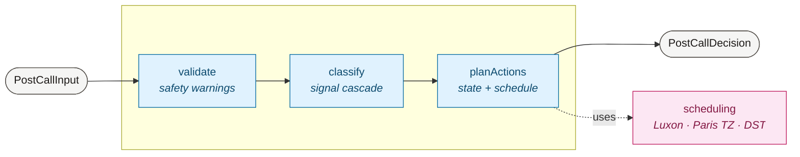

# Voxfit — Post-Call Decision Engine

> Take-home exercise. A deterministic TypeScript module that turns post-call signals
> (telephony, transcript-derived insights, tool events, case context) into a normalized
> decision: what the outcome was, how the case should move, and what to schedule next.

**Status:** 109 tests (99 unit + 10 end-to-end JSON scenarios), all green. Strict
TypeScript, zero `any`, zero clock reads in `src/`. Coverage thresholds 90% (current:
96% statements / 90% branches / 97% functions / 96% lines).

## Pipeline at a glance



Four pure functions (`validate`, `classify`, `scheduling`, `planActions`) glued by a
15-line orchestrator. `now` is always an input — no clock reads. Same input → same
output.

## TL;DR

```ts
import { buildPostCallDecision } from "voxfit-post-call-decision-engine";

const decision = buildPostCallDecision({
  now: "2025-03-15T14:00:00.000Z",
  timezone: "Europe/Paris",
  call: { callSid: "CA123", status: "completed", amdStatus: "human", durationSec: 60, performedAt: "2025-03-15T13:59:00.000Z" },
  case: { caseId: "case-1", status: "active", amountRemaining: 250, currency: "EUR" },
  step: { stepActionId: "step-1", maxAttempts: 5, attemptsSoFar: 0, retryDelayHours: 24, promiseFollowupDelayDays: 1 },
  insights: { outcome: "Accepted full payment later", paymentDate: "2025-04-01" },
  toolEvents: [],
});
// → normalizedOutcome: "promise_to_pay"
// → casePatch: { status: "temp_excluded", paymentPromiseDate: "2025-04-01", nextActionAt: "..." }
// → scheduledActions: [{ type: "call", runAt: ... }, { type: "payment_reminder", runAt: "2025-04-01T07:00:00.000Z" }]
// → auditLog: ["classify: insights.outcome=\"Accepted full payment later\" → promise_to_pay", "plan: ..."]
```

Pure function. No I/O. No clock reads. Same input → same output.

## Run it

Requires Node 20+. Uses **pnpm**.

```sh
pnpm install
pnpm test         # run all 109 tests once
pnpm test:watch   # TDD loop
pnpm typecheck    # tsc --noEmit
pnpm coverage     # vitest with v8 coverage (thresholds: 90% across the board)
pnpm check        # typecheck + test (CI runs this)
```

CI is **manual-only** (workflow_dispatch). Trigger it from the GitHub Actions tab,
picking the branch (`main` or `dev-meta`). It runs `typecheck` + `coverage` and uploads
the HTML report as an artifact. See [`.github/workflows/ci.yml`](.github/workflows/ci.yml).

## Where to look

**Start here:**
- [`scenarios/`](scenarios/) — 10 JSON fixtures showing the full input/output for the
  main outcomes. Read these first — they're worth 1000 words of docs.
- [`docs/design.md`](docs/design.md) — problem framing, decomposition, choices, tradeoffs.

**Source:**
- [`src/buildPostCallDecision.ts`](src/buildPostCallDecision.ts) — the orchestrator
  (validate → classify → planActions).
- [`src/validate.ts`](src/validate.ts) — runtime sanity checks → warnings (timezone,
  duration, performedAt, amountRemaining, call window).
- [`src/classify.ts`](src/classify.ts) — signal cascade (telephony overrides AI).
- [`src/scheduling.ts`](src/scheduling.ts) — Luxon-based time / TZ / DST helpers.
- [`src/planActions.ts`](src/planActions.ts) — outcome → case patches + scheduled actions.
- [`src/sanitize.ts`](src/sanitize.ts) — `sanitize()` + `truncate()` for audit-log
  defense in depth.

**Tests:**
- [`tests/edge-cases.test.ts`](tests/edge-cases.test.ts) — explicit edge cases from the
  sujet's "Edge Cases To Consider" list.
- [`tests/edge-cases-extra.test.ts`](tests/edge-cases-extra.test.ts) — 17 additional
  edge cases we brainstormed beyond the sujet.

**For any AI session touching this repo:** [`CLAUDE.md`](CLAUDE.md) — hard rules (TDD
discipline, no clock reads, audit-log contract).

## Approach in one paragraph

A pipeline of pure functions — `validate` (input sanity → warnings), `classify` (signal
cascade → normalized outcome), and `planActions` (outcome + context → case patches +
scheduled actions), glued by a 15-line `buildPostCallDecision`. Chosen for testability
(each layer tested in isolation), determinism (everything is a transform of inputs,
including `now`), and explainability (every branch drops one audit line). Time
arithmetic uses Luxon so DST in `Europe/Paris` doesn't lie. The classification cascade
is order-sensitive: telephony safety signals (`amdStatus`, `status`, `durationSec`)
override AI insights — we don't trust a transcript-extracted "promise to pay" on a call
that never connected.

## Assumptions, tradeoffs, limitations

All in [`docs/`](docs/):

- **[`docs/tradeoffs.md`](docs/tradeoffs.md)** — every meaningful choice (architecture,
  Luxon over `Date`, cascade order, window-end exclusivity, ...) with what was given up.
- **[`docs/limitations.md`](docs/limitations.md)** — what's not done, organized by
  **why**: capped by timebox (§1), capped by missing business decisions (§2), or
  deliberately out of scope (§3). §2 is the most important read.
- **[`docs/business-rules.md`](docs/business-rules.md)** — the 14 codified rules with
  pointers to the tests that verify each.
- **[`docs/edge-cases.md`](docs/edge-cases.md)** — every edge case considered (covered
  + acknowledged-but-not-handled).

## How I used AI

This solution was built with Claude Code (Opus 4.7). For a full account of my AI-era
methodology — and what I pushed back on during this take-home — see
**[`docs/AI_USAGE.md`](docs/AI_USAGE.md)**.

The short version: I caught a monolith proposal early, pushed for Luxon over native
`Date`, fixed a regex bug in the AI's sanitize implementation, rejected a `DateTime.now()`
"convenience" call that would have broken determinism, and re-read the cascade order
against sujet §1 before letting it stand. TDD discipline meant every test file was red
before green — the commit history records this.
